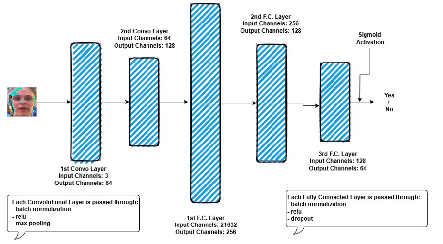
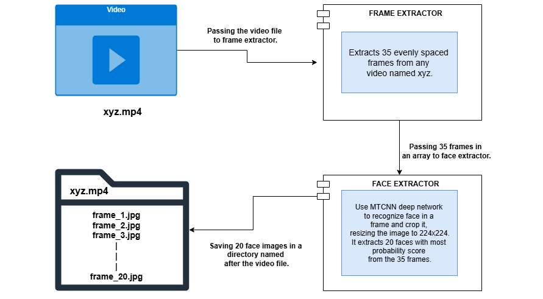

# Deepfake Image Classification
## 📌 Project Overview

The goal was to create a binary image classification model using PyTorch to differentiate between real and fake images with high accuracy and generalization.

I fine-tuned a pre-trained ResNet50 model by modifying its final classification layer to adapt it for binary classification. Also compared the pre-trained approach with a custom CNN approach.
The project was implemented with best practices such as Batch Normalization, ReLU activation, and BCEWithLogitsLoss for stable training.

## 🛠️ Technologies & Libraries Used
- Python – Core programming language
- PyTorch – Model architecture, training loop, loss function, and optimizers
- Torchvision – ResNet50 pre-trained model and image transformations
- NumPy & Pandas – Data handling and analysis
- Matplotlib – Visualization of training/validation metrics

## ⚙️ Custom CNN Model Architecture


## ⚙️ Pretrained Resnet50 Model Architecture
- Base Model: ResNet18 (pre-trained on ImageNet)
- Modified Fully Connected Layer:
```bash
model.fc = nn.Linear(in_features=model.fc.in_features, out_features=1)
```
- Activation Function: ReLU (for hidden layers)
- Batch Normalization: For stable and faster convergence
- Loss Function: BCEWithLogitsLoss (combines Sigmoid + Binary Cross-Entropy)
- Optimizer: Adam

## 📂 Dataset Preparation


## 📊 Results
- Test Accuracy on Custom CNN: ~54%
- Test Accuracy on Resnet50: ~91%
- Due to less data and some random noise model has overfitted.

## 🚀 Future Improvements
- Use Hybrid Architectures combining CNNs + LSTMs for improved feature extraction.
- Increase dataset size.
- Implement Cross-Dataset Validation for better generalization.
